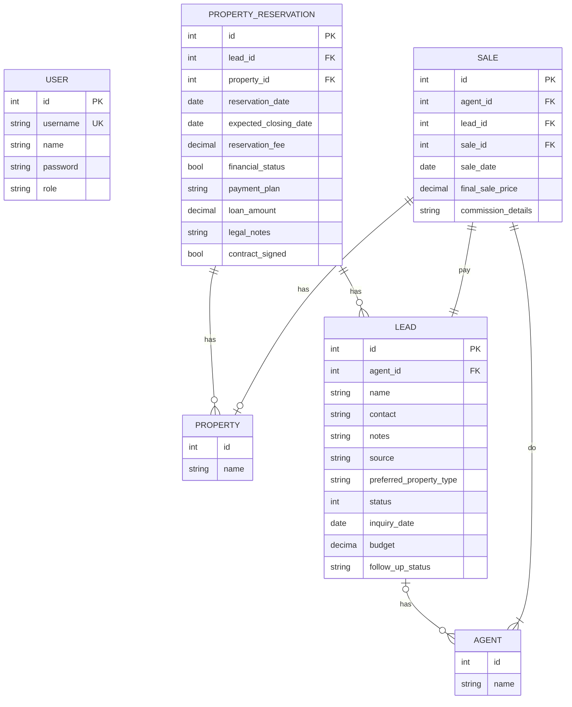

# System Design

# ER Diagram

```mermaid
erDiagram
    USER {
        int id PK
        string username UK
        string name 
        string password
        string role
    }
    PROPERTY {
        int id
        string name
    }
    AGENT {
        int id
        string name
    }
    SALE {
        int id PK
        int agent_id FK
        int lead_id FK
        int sale_id FK
        date sale_date
        decimal final_sale_price
        string commission_details
    }
    PROPERTY_RESERVATION {
        int id PK
        int lead_id FK
        int property_id FK
        date reservation_date
        date expected_closing_date
        decimal reservation_fee
        bool financial_status
        string payment_plan
        decimal loan_amount
        string legal_notes
        bool contract_signed
    }
    LEAD {
        int id PK
        int agent_id FK
        string name
        string contact
        string notes
        string source
        string preferred_property_type
        int status
        date inquiry_date
        decima budget
        string follow_up_status
    }
    LEAD |o--o{ AGENT : has
    PROPERTY_RESERVATION ||--o{ PROPERTY : has
    PROPERTY_RESERVATION ||--o{ LEAD : has
    SALE ||--o| PROPERTY : has
    SALE ||--|| LEAD : pay
    SALE ||--|{ AGENT : do

```