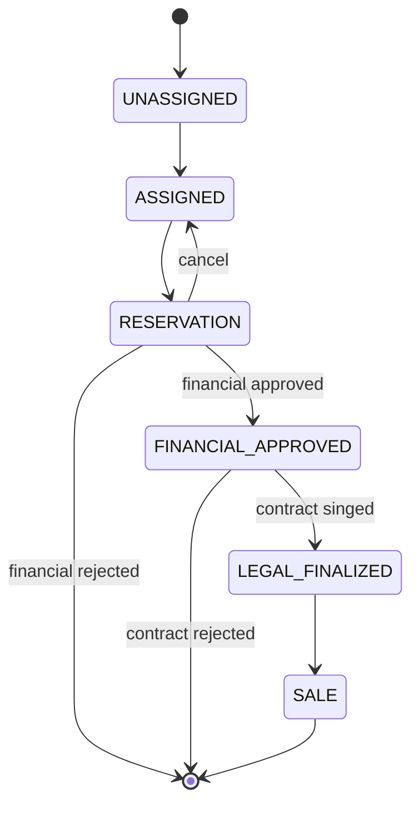
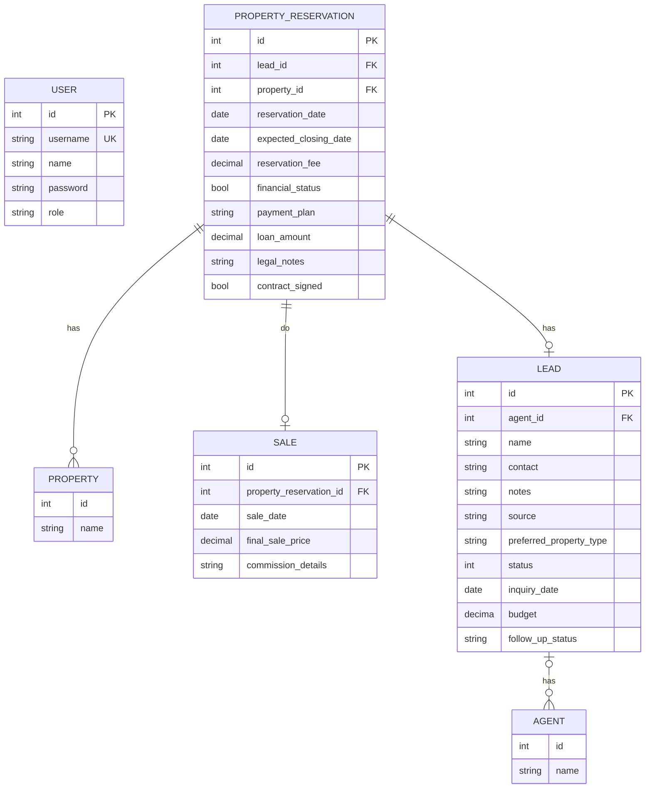

# System Design Decisions

The system was designed with the necessary apis to handle the state transition of lead entity. 

There are 2 roles in the system which created to address role-based access functional requirement. APIs are restricted for a specific role or public. For authentication, Basic Authentication is used instead of JWT. 

Role based restrictions are forced through api filtering. Method security is not used considering the simplicity of the task.

# State Diagram

Below diagram shows how the lead status is transitionaing between status based on the actions.

# ER Diagram

